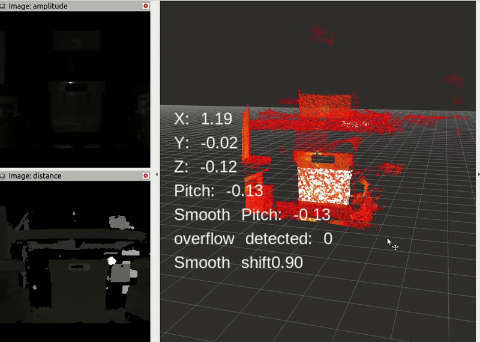

# plane_segmentation_tool 
## 🌀 Demo




---

## 🚀 What it is

A high-precision, modular pipeline for extracting stable planar regions from noisy point clouds — built for robotics applications like pose estimation, box picking, and real-time scene understanding.

---

## 📦 What It Does

Given a raw `.pcd` file (or live point cloud stream):

- ✅ Denoises & downsamples using voxel grid + statistical filters  
- ✅ Performs **two-stage RANSAC** to extract dominant planar regions  
- ✅ Uses **Euclidean clustering** to isolate the relevant object  
- ✅ Applies **MLS smoothing** for sub-mm accurate plane fit  
- ✅ Saves the result to `/output/` and previews using `pcl_viewer`

---

## 🛠️ How To Build

### 🧱 Prerequisites

- Ubuntu 22.04+  
- PCL 1.12+  
- CMake  
- g++ / build-essential  

### 🔧 Build Instructions

```bash
git clone git@github.com:daatsi-aeres/plane_segmentation_tool.git
cd plane_segmentation_tool
mkdir build && cd build
cmake ..
make -j8
```
### 🧪 How to Use
```bash

./plane_segmenter ../data/input.pcd ../config/config.json
```
After running, your cleaned plane will be stored in:

```bash
output/final_output.pcd
```
You can view it using:

```bash
pcl_viewer output/final_output.pcd
```
### 🔍 Use Case
Developed for a robotic pose estimation pipeline where:

Barcodes & fiducials were not reliable

Sub-mm plane extraction was required

Real-time performance was critical

Ideal for robotics, AR/VR, inspection, or any task requiring clean planar detection from raw 3D point clouds.

### 🤝 Contributing
Pull requests welcome! Whether it’s adding new features, improving performance, or extending it to other segmentation tasks — your contributions are appreciated.

### 📜 License
MIT License


